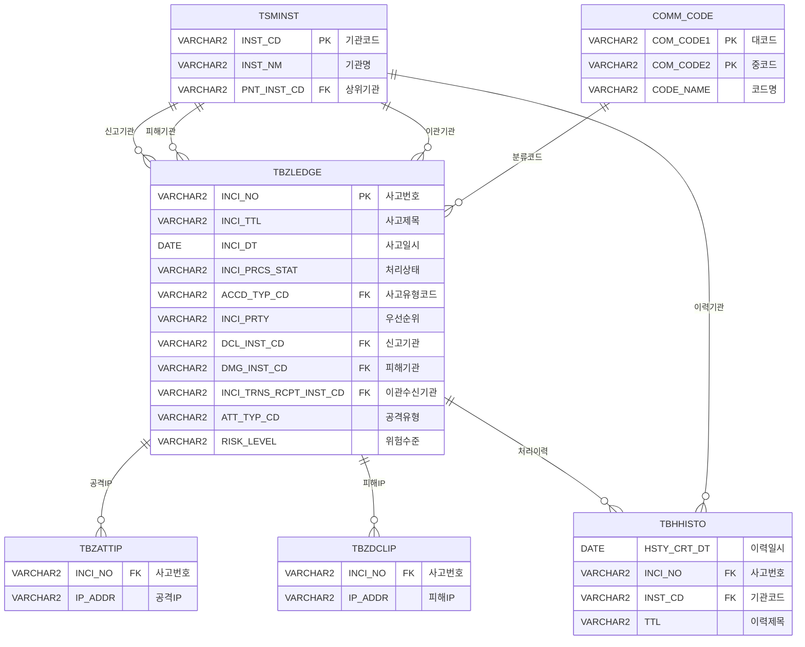
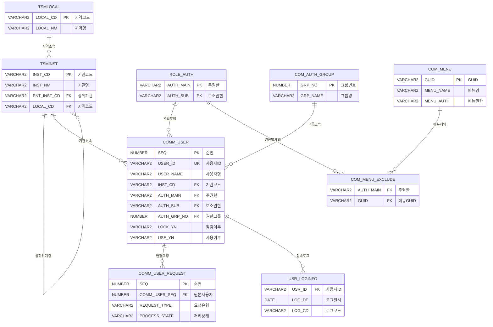
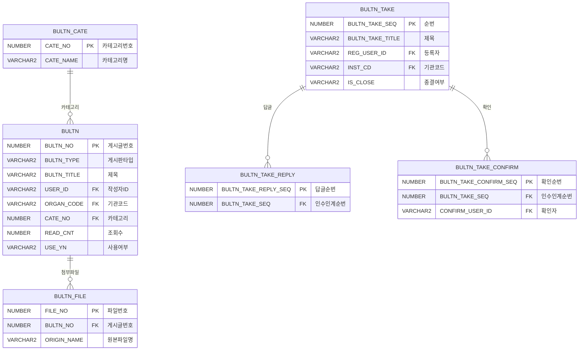
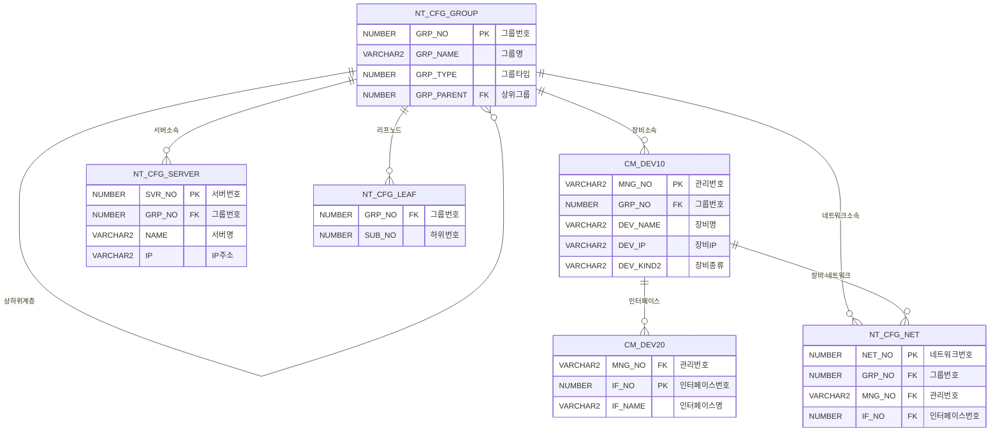

# KLID Backend - Logical ERD

## 전체 논리 ERD

```mermaid
erDiagram
    %% ========================================
    %% 1. 기관 관리 (Institution Management)
    %% ========================================
    TSMINST {
        VARCHAR2 INST_CD PK "기관코드"
        VARCHAR2 INST_NM "기관명"
        VARCHAR2 PNT_INST_CD FK "상위기관코드"
        VARCHAR2 LOCAL_CD FK "지역코드"
        NUMBER INST_LEVEL "기관레벨"
        NUMBER DEPTH "깊이"
        VARCHAR2 USE_YN "사용여부"
        NUMBER LEVEL_NO "레벨번호"
        VARCHAR2 PARENT_CD "부모코드"
    }

    TSMLOCAL {
        VARCHAR2 LOCAL_CD PK "지역코드"
        VARCHAR2 LOCAL_NM "지역명"
    }

    TSMINST_LEAF {
        VARCHAR2 INST_CD FK "기관코드"
        VARCHAR2 SUB_CD "하위코드"
        NUMBER GRP_NO "그룹번호"
        VARCHAR2 ISLEAF "리프여부"
    }

    %% ========================================
    %% 2. 사용자 관리 (User Management)
    %% ========================================
    COMM_USER {
        NUMBER SEQ PK "순번"
        VARCHAR2 USER_ID UK "사용자ID"
        VARCHAR2 USER_NAME "사용자명"
        VARCHAR2 USER_PWD "비밀번호"
        VARCHAR2 INST_CD FK "기관코드"
        VARCHAR2 MOBL_PHN_NO "휴대폰번호"
        VARCHAR2 EMAIL_ADDR "이메일"
        VARCHAR2 AUTH_MAIN FK "주권한"
        VARCHAR2 AUTH_SUB FK "보조권한"
        NUMBER AUTH_GRP_NO FK "권한그룹번호"
        VARCHAR2 OTP_KEY "OTP키"
        VARCHAR2 PKI_DN "PKI인증서"
        VARCHAR2 LOCK_YN "잠김여부"
        NUMBER LOGIN_FAIL_CNT "로그인실패횟수"
        VARCHAR2 USE_YN "사용여부"
        VARCHAR2 CENTER_USER_YN "센터사용자여부"
        DATE REG_DT "등록일시"
    }

    COMM_USER_REQUEST {
        NUMBER SEQ PK "순번"
        NUMBER COMM_USER_SEQ FK "원본사용자SEQ"
        NUMBER REQUEST_USER_SEQ FK "요청자SEQ"
        VARCHAR2 REQUEST_INST_CD FK "요청기관코드"
        VARCHAR2 REQUEST_TYPE "요청유형"
        VARCHAR2 REQUEST_REASON "요청사유"
        DATE REQUEST_REG_DT "요청등록일시"
        VARCHAR2 PROCESS_STATE "처리상태"
    }

    ROLE_AUTH {
        VARCHAR2 AUTH_MAIN PK "주권한"
        VARCHAR2 AUTH_SUB PK "보조권한"
        VARCHAR2 ROLE_TBZ_01 "사고게시판역할1"
        VARCHAR2 ROLE_NOT_01 "공지게시판역할1"
        VARCHAR2 ROLE_RES_01 "자료게시판역할1"
        VARCHAR2 ROLE_SHA_01 "공유게시판역할1"
        VARCHAR2 ROLE_QNA_01 "QnA게시판역할1"
    }

    COM_AUTH_GROUP {
        NUMBER GRP_NO PK "그룹번호"
        VARCHAR2 GRP_NAME "그룹명"
    }

    %% ========================================
    %% 3. 사고 관리 (Incident Management)
    %% ========================================
    TBZLEDGE {
        VARCHAR2 INCI_NO PK "사고번호"
        VARCHAR2 INCI_TTL "사고제목"
        VARCHAR2 INCI_DTT_NM "사고상세명"
        DATE INCI_DT "사고일시"
        DATE INCI_ACPN_DT "사고접수일시"
        VARCHAR2 INCI_PRCS_STAT "사고처리상태"
        VARCHAR2 ACCD_TYP_CD FK "사고유형코드"
        VARCHAR2 INCI_PRTY "사고우선순위"
        VARCHAR2 INCI_TYP_CD "사고타입코드"
        VARCHAR2 NET_DIV "망구분"
        VARCHAR2 ACPN_MTHD "접수방법"
        VARCHAR2 RISK_LEVEL "위험수준"
        VARCHAR2 DCL_INST_CD FK "신고기관코드"
        VARCHAR2 DMG_INST_CD FK "피해기관코드"
        VARCHAR2 INCI_TRNS_RCPT_INST_CD FK "이관수신기관코드"
        VARCHAR2 INCI_TRNS_REQ_INST_CD FK "이관요청기관코드"
        VARCHAR2 DCL_CRGR_ID "신고담당자ID"
        VARCHAR2 ATT_TYP_CD "공격유형코드"
        VARCHAR2 ATT_NATN_CD "공격국가코드"
        CLOB INCI_DCL_CONT "사고신고내용"
        CLOB INCI_INVS_CONT "사고조사내용"
        CLOB INCI_END_CONT "사고종료내용"
        VARCHAR2 REMARKS "비고"
    }

    TBZATTIP {
        VARCHAR2 INCI_NO FK "사고번호"
        VARCHAR2 IP_ADDR "공격IP주소"
    }

    TBZDCLIP {
        VARCHAR2 INCI_NO FK "사고번호"
        VARCHAR2 IP_ADDR "피해IP주소"
    }

    TBHHISTO {
        DATE HSTY_CRT_DT "이력생성일시"
        VARCHAR2 INCI_NO FK "사고번호"
        VARCHAR2 INST_CD FK "기관코드"
        VARCHAR2 TTL "제목"
    }

    %% ========================================
    %% 4. 공통 코드 (Common Code)
    %% ========================================
    COMM_CODE {
        VARCHAR2 COM_CODE1 PK "대코드"
        VARCHAR2 COM_CODE2 PK "중코드"
        VARCHAR2 COM_CODE3 PK "소코드"
        NUMBER CODE_LVL PK "코드레벨"
        VARCHAR2 CODE_NAME "코드명"
        VARCHAR2 USE_YN "사용여부"
    }

    %% ========================================
    %% 5. 게시판 (Board System)
    %% ========================================
    BULTN {
        NUMBER BULTN_NO PK "게시글번호"
        VARCHAR2 BULTN_TYPE "게시판타입"
        VARCHAR2 BULTN_TITLE "게시글제목"
        CLOB BULTN_CONT "게시글내용"
        NUMBER READ_CNT "조회수"
        DATE REG_DATE "등록일시"
        VARCHAR2 USER_ID FK "사용자ID"
        VARCHAR2 USER_NAME "사용자명"
        VARCHAR2 ORGAN_CODE FK "기관코드"
        NUMBER CATE_NO FK "카테고리번호"
        NUMBER GROUP_NO "그룹번호"
        NUMBER LEVEL_NO "레벨번호"
        NUMBER ORDER_NO "순서번호"
        VARCHAR2 OPEN_SCOPE "공개범위"
        VARCHAR2 EXIST_FILE "파일존재여부"
        VARCHAR2 IS_SECRET "비밀글여부"
        VARCHAR2 USE_YN "사용여부"
    }

    BULTN_FILE {
        NUMBER FILE_NO PK "파일번호"
        NUMBER BULTN_NO FK "게시글번호"
        VARCHAR2 FILE_NAME "저장파일명"
        VARCHAR2 ORIGIN_NAME "원본파일명"
    }

    BULTN_CATE {
        NUMBER CATE_NO PK "카테고리번호"
        VARCHAR2 CATE_NAME "카테고리명"
        VARCHAR2 CATE_GROUP "카테고리그룹"
    }

    %% ========================================
    %% 6. 인수인계 (Handover)
    %% ========================================
    BULTN_TAKE {
        NUMBER BULTN_TAKE_SEQ PK "인수인계순번"
        VARCHAR2 BULTN_TAKE_TITLE "제목"
        CLOB BULTN_TAKE_CONT "내용"
        DATE REG_DATE "등록일시"
        VARCHAR2 REG_USER_ID FK "등록사용자ID"
        VARCHAR2 REG_USER_NAME "등록사용자명"
        DATE ALARM_DATE "알람일시"
        VARCHAR2 ALARM_UNIT "알람단위"
        VARCHAR2 IS_CLOSE "종결여부"
        VARCHAR2 INST_CD FK "기관코드"
    }

    BULTN_TAKE_REPLY {
        NUMBER BULTN_TAKE_REPLY_SEQ PK "답글순번"
        NUMBER BULTN_TAKE_SEQ FK "인수인계순번"
        CLOB BULTN_TAKE_REPLY_CONT "답글내용"
        DATE REG_DATE "등록일시"
        VARCHAR2 REG_USER_ID "등록사용자ID"
        VARCHAR2 REG_USER_NAME "등록사용자명"
    }

    BULTN_TAKE_CONFIRM {
        NUMBER BULTN_TAKE_CONFIRM_SEQ PK "확인순번"
        NUMBER BULTN_TAKE_SEQ FK "인수인계순번"
        VARCHAR2 CONFIRM_USER_ID FK "확인사용자ID"
        DATE CONFIRM_DATE "확인일시"
    }

    %% ========================================
    %% 7. 메뉴 관리 (Menu Management)
    %% ========================================
    COM_MENU {
        NUMBER MENU_NO PK "메뉴번호"
        VARCHAR2 MENU_NAME "메뉴명"
        VARCHAR2 MENU_KIND "메뉴종류"
        NUMBER MENU_PAGE_NO "페이지번호"
        NUMBER MENU_PAGE_GRP_NO "페이지그룹번호"
        VARCHAR2 GUID UK "GUID"
        VARCHAR2 MENU_AUTH "메뉴권한"
        NUMBER VISIBLE_ORDER "표시순서"
        VARCHAR2 SITE_NAME "사이트명"
        VARCHAR2 IS_WEBUSE "웹사용여부"
    }

    COM_MENU_EXCLUDE {
        VARCHAR2 AUTH_MAIN FK "주권한"
        VARCHAR2 GUID FK "메뉴GUID"
    }

    %% ========================================
    %% 8. 네트워크/장비 관리 (Network/Device)
    %% ========================================
    NT_CFG_GROUP {
        NUMBER GRP_NO PK "그룹번호"
        VARCHAR2 GRP_NAME "그룹명"
        NUMBER GRP_TYPE "그룹타입"
        NUMBER GRP_PARENT FK "상위그룹"
        VARCHAR2 GRP_FLAG "그룹플래그"
    }

    NT_CFG_LEAF {
        NUMBER GRP_NO FK "그룹번호"
        NUMBER SUB_NO "하위번호"
        VARCHAR2 ISLEAF "리프여부"
    }

    CM_DEV10 {
        VARCHAR2 MNG_NO PK "관리번호"
        NUMBER GRP_NO FK "그룹번호"
        VARCHAR2 DEV_NAME "장비명"
        VARCHAR2 DEV_IP "장비IP"
        VARCHAR2 DEV_KIND1 "장비종류1"
        VARCHAR2 DEV_KIND2 "장비종류2"
        VARCHAR2 MODEL "모델"
    }

    CM_DEV20 {
        VARCHAR2 MNG_NO FK "관리번호"
        NUMBER IF_IDX "인터페이스인덱스"
        NUMBER IF_NO PK "인터페이스번호"
        VARCHAR2 IF_NAME "인터페이스명"
        VARCHAR2 IF_ALIAS "인터페이스별칭"
    }

    NT_CFG_SERVER {
        NUMBER SVR_NO PK "서버번호"
        NUMBER GRP_NO FK "그룹번호"
        VARCHAR2 NAME "서버명"
        VARCHAR2 IP "IP주소"
    }

    NT_CFG_NET {
        NUMBER NET_NO PK "네트워크번호"
        NUMBER GRP_NO FK "그룹번호"
        VARCHAR2 MNG_NO FK "관리번호"
        NUMBER IF_NO FK "인터페이스번호"
        VARCHAR2 IF_INOUT "입출력"
    }

    %% ========================================
    %% 9. 모니터링 (Monitoring)
    %% ========================================
    THREAT_NOW {
        NUMBER PAST_THREAT "이전위협레벨"
        NUMBER NOW_THREAT "현재위협레벨"
        VARCHAR2 INST_CD FK "기관코드"
        DATE MOD_DT "수정일시"
    }

    THREAT_BASIS {
        NUMBER LEVEL_CD PK "레벨코드"
        VARCHAR2 LEVEL_NM "레벨명"
    }

    HM_HC_URL {
        NUMBER SEQ_NO PK "순번"
        VARCHAR2 INST_CD FK "기관코드"
        VARCHAR2 URL "URL"
        NUMBER LAST_RES "마지막응답코드"
        VARCHAR2 USE_YN "사용여부"
        VARCHAR2 LOCAL_CD FK "지역코드"
    }

    FORGERY_URL {
        VARCHAR2 INST_CD FK "기관코드"
        VARCHAR2 URL "URL"
        NUMBER LAST_RES "마지막응답코드"
        VARCHAR2 LOCAL_CD FK "지역코드"
    }

    %% ========================================
    %% 10. 로그 (Log)
    %% ========================================
    USR_LOGINFO {
        VARCHAR2 USR_ID FK "사용자ID"
        DATE LOG_DT "로그일시"
        VARCHAR2 LOG_CD "로그코드"
        VARCHAR2 USR_IP "사용자IP"
        VARCHAR2 MENU_CD "메뉴코드"
        VARCHAR2 REMARK "비고"
    }

    %% ========================================
    %% Relationships
    %% ========================================

    %% 기관 관계
    TSMLOCAL ||--o{ TSMINST : "지역에 기관 소속"
    TSMINST ||--o{ TSMINST : "상위-하위 기관 (PNT_INST_CD)"
    TSMINST ||--o{ TSMINST_LEAF : "기관 리프 관리"

    %% 사용자 관계
    TSMINST ||--o{ COMM_USER : "기관에 사용자 소속"
    ROLE_AUTH ||--o{ COMM_USER : "역할 권한 부여"
    COM_AUTH_GROUP ||--o{ COMM_USER : "권한 그룹 소속"
    COMM_USER ||--o{ COMM_USER_REQUEST : "사용자 변경요청"

    %% 사고 관계
    TSMINST ||--o{ TBZLEDGE : "신고기관 (DCL_INST_CD)"
    TSMINST ||--o{ TBZLEDGE : "피해기관 (DMG_INST_CD)"
    COMM_CODE ||--o{ TBZLEDGE : "사고유형/상태 코드"
    TBZLEDGE ||--o{ TBZATTIP : "공격 IP 목록"
    TBZLEDGE ||--o{ TBZDCLIP : "피해 IP 목록"
    TBZLEDGE ||--o{ TBHHISTO : "사고 처리 이력"
    TSMINST ||--o{ TBHHISTO : "이력 기관"

    %% 게시판 관계
    TSMINST ||--o{ BULTN : "기관 게시글"
    BULTN_CATE ||--o{ BULTN : "카테고리별 게시글"
    BULTN ||--o{ BULTN_FILE : "게시글 첨부파일"

    %% 인수인계 관계
    TSMINST ||--o{ BULTN_TAKE : "기관 인수인계"
    BULTN_TAKE ||--o{ BULTN_TAKE_REPLY : "인수인계 답글"
    BULTN_TAKE ||--o{ BULTN_TAKE_CONFIRM : "인수인계 확인"

    %% 메뉴 관계
    COM_MENU ||--o{ COM_MENU_EXCLUDE : "메뉴 제외 설정"

    %% 네트워크/장비 관계
    NT_CFG_GROUP ||--o{ NT_CFG_GROUP : "상위-하위 그룹 (GRP_PARENT)"
    NT_CFG_GROUP ||--o{ NT_CFG_LEAF : "그룹 리프"
    NT_CFG_GROUP ||--o{ CM_DEV10 : "그룹에 장비 소속"
    NT_CFG_GROUP ||--o{ NT_CFG_SERVER : "그룹에 서버 소속"
    NT_CFG_GROUP ||--o{ NT_CFG_NET : "그룹에 네트워크 소속"
    CM_DEV10 ||--o{ CM_DEV20 : "장비 인터페이스"
    CM_DEV10 ||--o{ NT_CFG_NET : "장비-네트워크 매핑"

    %% 모니터링 관계
    TSMINST ||--o{ THREAT_NOW : "기관별 위협 현황"
    THREAT_BASIS ||--o{ THREAT_NOW : "위협 레벨 기준"
    TSMINST ||--o{ HM_HC_URL : "기관 헬스체크 URL"
    TSMINST ||--o{ FORGERY_URL : "기관 위변조 URL"
    TSMLOCAL ||--o{ HM_HC_URL : "지역별 헬스체크"
    TSMLOCAL ||--o{ FORGERY_URL : "지역별 위변조"

    %% 로그 관계
    COMM_USER ||--o{ USR_LOGINFO : "사용자 접속 로그"
```

## 도메인별 ERD

### 1. 사고 관리 (Incident Management) - 핵심 도메인

### 2. 사용자/권한 관리 (User & Auth)

### 3. 게시판/인수인계 (Board & Handover)

### 4. 네트워크/장비 관리 (Network & Device)

## 주요 코드 그룹 (COMM_CODE)

| 대코드 | 설명 | 예시 |
|--------|------|------|
| 3001 | 사고처리상태 | 접수, 조사중, 이관, 종료 |
| 3002 | 사고유형 | DDoS, 악성코드, 홈페이지변조 등 |
| 3004 | 접수방법 | 전화, 이메일, 시스템 |
| 3006 | 사고우선순위 | 긴급, 높음, 보통, 낮음 |
| 4001 | 권고사고코드 | - |
| 4004 | 망구분 | 인터넷망, 내부망 |

## 테이블 요약

| 도메인 | 테이블 수 | 핵심 테이블 |
|--------|-----------|------------|
| 기관 관리 | 3 | TSMINST, TSMLOCAL |
| 사용자/권한 | 4 | COMM_USER, ROLE_AUTH |
| 사고 관리 | 4 | TBZLEDGE (중심) |
| 공통 코드 | 1 | COMM_CODE |
| 게시판 | 3 | BULTN |
| 인수인계 | 3 | BULTN_TAKE |
| 메뉴 | 3 | COM_MENU |
| 네트워크/장비 | 6 | NT_CFG_GROUP, CM_DEV10 |
| 모니터링 | 4 | THREAT_NOW, HM_HC_URL |
| 로그 | 1 | USR_LOGINFO |
| **합계** | **32+** | |
